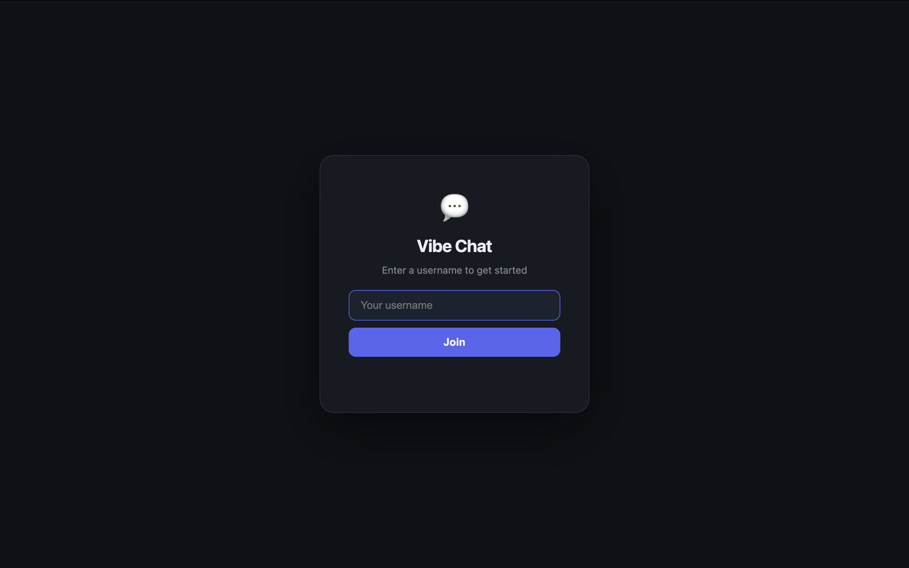
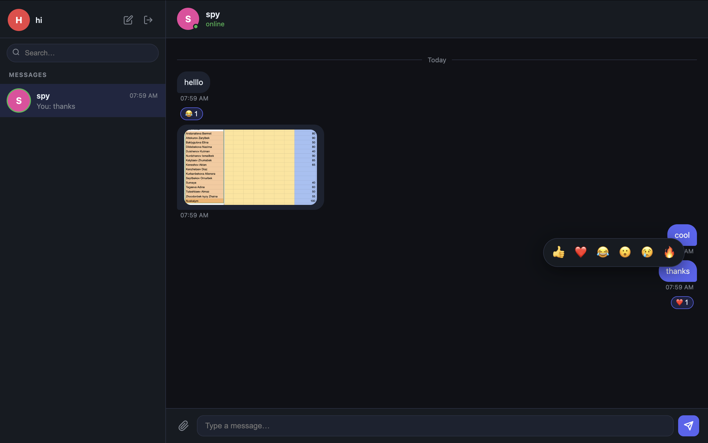

# 💬 Vibe Chat — Real-time Messaging App

> A clean, modern chat application built with FastAPI and WebSockets. Inspired by WhatsApp.

[](https://python.org)
[](https://fastapi.tiangolo.com)
[](https://sqlite.org)
[](https://vibe-chat-production-ba9b.up.railway.app)
[](LICENSE)

<br/>

**🌐 Live Demo → [vibe-chat-production-ba9b.up.railway.app](https://vibe-chat-production-ba9b.up.railway.app)**  
**📦 GitHub → [github.com/Aktansensei/vibe-chat](https://github.com/Aktansensei/vibe-chat)**  
**🎥 YouTube Demo → _coming soon_**

---

## 📸 Screenshots


| Login | Chat |
|:---:|:---:|
|  |  |

---

## ✨ Features

- ⚡ **Real-time chat with WebSockets** — instant message delivery, no polling
- 🖼 **Image sharing** — send photos directly in chat (up to 2 MB)
- 😂 **Message reactions** — right-click any message to react: 👍 ❤️ 😂 😮 😢 🔥
- ✍️ **Typing indicators** — animated dots when the other person is typing
- 🟢 **Online / Last seen status** — know when your contact is active
- 🔴 **Unread message counters** — badge per contact in the sidebar
- 💬 **Recent chat list** — last message preview with timestamp
- 📎 **File attachment button** — paperclip icon for quick image sending
- 🌙 **Clean modern dark UI** — no frameworks, pure CSS + vanilla JS
- 🏗 **Layered architecture** — strict routers → services → repositories separation

---

## 🛠 Tech Stack

| Layer | Technology |
|---|---|
| **Backend** | [FastAPI](https://fastapi.tiangolo.com) 0.115 |
| **Real-time** | WebSockets (native FastAPI) |
| **ORM** | [SQLAlchemy](https://sqlalchemy.org) 2.0 |
| **Database** | SQLite |
| **Validation** | [Pydantic](https://docs.pydantic.dev) v2 |
| **Server** | [Uvicorn](https://www.uvicorn.org) + uvloop |
| **Frontend** | Vanilla JS + CSS (zero dependencies) |
| **Hosting** | [Railway](https://railway.app) |

---

## 🚀 Getting Started

### Prerequisites

- Python 3.11+

### Run locally

```bash
# 1. Clone the repo
git clone https://github.com/Aktansensei/vibe-chat.git
cd vibe-chat

# 2. Create and activate virtual environment
python -m venv venv
source venv/bin/activate      # macOS / Linux
# venv\Scripts\activate       # Windows

# 3. Install dependencies
pip install -r requirements.txt

# 4. Start the server
uvicorn main:app --reload
```

Open **http://localhost:8000** in your browser.

> 💡 To test real-time features, open the app in two browser tabs (or normal + incognito) and register as two different users.

---

## 📁 Project Structure

```
vibe_chat/
├── main.py                  # FastAPI app, CORS, router registration
├── database.py              # SQLite engine, Base, get_db, run_migrations
├── requirements.txt
│
├── models/                  # SQLAlchemy ORM models
│   ├── user.py              # User (id, username, last_seen)
│   └── message.py           # Message (content, type, media, reactions)
│
├── schemas/                 # Pydantic request/response schemas
│   ├── user.py
│   └── message.py
│
├── repositories/            # Database access layer (SQL only)
│   ├── user_repository.py
│   └── message_repository.py
│
├── services/                # Business logic layer
│   ├── user_service.py
│   └── message_service.py
│
├── routers/                 # HTTP + WebSocket endpoints
│   ├── user_router.py
│   ├── message_router.py
│   └── websocket_router.py
│
└── static/                  # Frontend (served at /)
    ├── index.html
    ├── style.css
    └── script.js
```

### Architecture contract

```
routers → services → repositories → models
```

- **Routers** — HTTP/WebSocket only, no business logic
- **Services** — all business rules, no SQL
- **Repositories** — all SQL, no business logic

---

## 📡 API Reference

### Users

| Method | Endpoint | Description |
|--------|----------|-------------|
| `POST` | `/users/register` | Register a new user |
| `GET` | `/users/` | List all users (`?search=` optional) |
| `GET` | `/users/{id}` | Get user by ID |
| `GET` | `/users/by-username/{username}` | Get user by username |

### Messages

| Method | Endpoint | Description |
|--------|----------|-------------|
| `POST` | `/messages/?sender_id={id}` | Send a message |
| `GET` | `/messages/recent?user_id={id}` | Get recent chat list |
| `GET` | `/messages/{other_id}?user_id={id}` | Get chat history |

### WebSocket — `WS /ws/{user_id}`

| Event (client → server) | Payload |
|---|---|
| Send message | `{ content, receiver_id, message_type, media_data? }` |
| Typing | `{ type: "typing", receiver_id }` |
| Stop typing | `{ type: "stop_typing", receiver_id }` |
| Reaction | `{ type: "reaction", message_id, emoji }` |

| Event (server → client) | Description |
|---|---|
| `sent` | Confirmation to sender |
| `received` | New message for recipient |
| `reaction_update` | Reaction changed on a message |
| `typing` / `stop_typing` | Typing indicator |
| `status` | User came online / went offline |
| `online_list` | Full list of online users on connect |

> Full interactive docs: [/docs](https://vibe-chat-production-ba9b.up.railway.app/docs)

---

## 📄 License

MIT © 2026 — [Aktansensei](https://github.com/Aktansensei)
